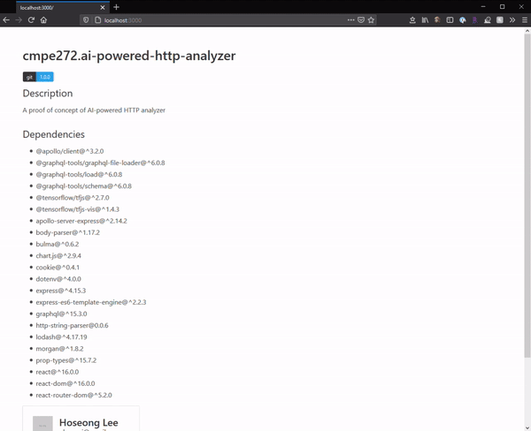

# AI-Powered HTTP Analyzer
### Introduction
One of the common way to achieve an IDS (Intrusion Detection System) is to use regex. However, the regex approach requires developers to maintain a list of various regex patterns and it is not a scalable approach.

Thus, a new idea was proposed in the project to provide an IDS system using Machine Learning. The AI-powered HTTP Analyzer would extract raw HTTP request string and process the string to generate feature properties. And the feature properties would be analyzed by a ML model that uses Logistic Regression model.

The analyer then would return a prediction, and the clients can use the prediction data in order to alarm possible attacaks on the system.

### Proof of Concept
Prior to the implementation, a research has been done in order to validate if the idea can be acheived in a realistic way. And a thesis[1] has been found and it demonstrates that the ML can be used to identify malicious HTTP requests.

In the thesis paper, Logistic Regression model has been employeed, and 9 features are used in order to do the ML analysis. However, for the scope of the project, only 5 features were selected since those features are the most important features acccording to the thesis.

- Length of the request
- Length of the arguments
- Number of arguments
- Length of the path
- Number of 'special' chars in the path

In order to train a ML model and use the model to predict the maliciousness of HTTP requests, TensorFlow[2] has been utilized.

And training data has been manually collected using the white hacking education tool Port Swigger[4]. Only 60 dataset has been collected where 30 of them are normal HTTP requests and the other 30 are abnormal HTTP requests.

### Demo

### Architecture
AI-powered HTTP Analyzer will contain maily three components (1) client-side library, (2) API, and (3) Machine Learning model. The client-side library would be injected to the consumer's codebase. And it will be used by the consumer's server as an interface to the analyzer's API.

The client-side library would capture raw HTTP request strings and make a network to the analyzer API asynchronously. Then the response would be returned to the consumer's server. And the consumer's server can process the result for their own purpose. For example, the consumer can store the prediction results in their own database and use it to make a monitoring and also make alert rules based on the prediction results.

### Future Works
The dataset used to train the ML model was too small to make the model mature enough and perform well. So in the future work, a new dataset would be gathered which would be more than 10,000.

Also, in our POC project, only 5 features are used in order to do the ML prediction. However, in the thesis, 9 features are used. Hence, 9 features and more training dataset are used, it is expected to achieve better accruacy of the ML model performance.

### References
[1] https://digitalcommons.kennesaw.edu/cgi/viewcontent.cgi?referer=https://www.google.com/&httpsredir=1&article=1053&context=ccerp

[2] https://www.tensorflow.org/js 

[3] https://towardsdatascience.com/diabetes-prediction-using-logistic-regression-with-tensorflow-js-35371e47c49d

[4] https://www.google.com/url?sa=t&rct=j&q=&esrc=s&source=web&cd=&ved=2ahUKEwiY2fm3l6LtAhWG1FkKHWxLDakQFjAAegQIARAD&url=https%3A%2F%2Fportswigger.net%2F&usg=AOvVaw16-jiiOSt90IfAqRjYGmeB